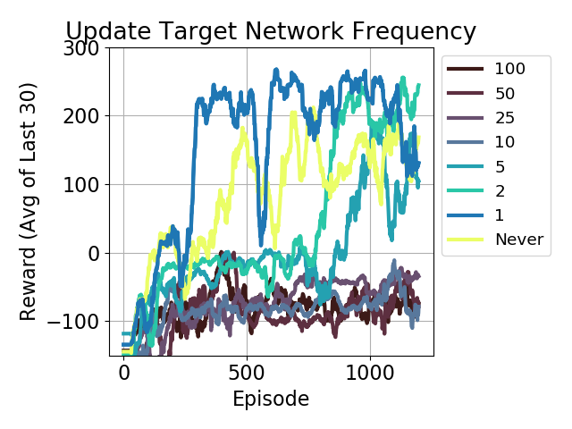
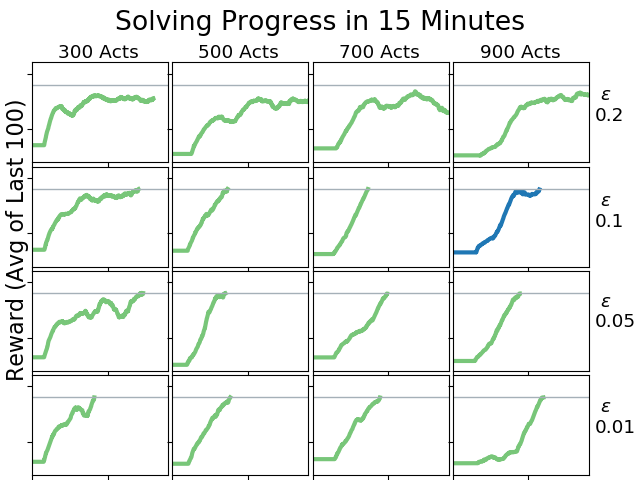
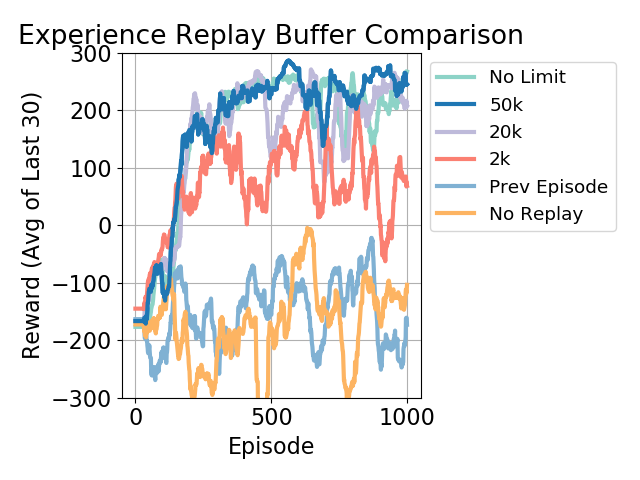
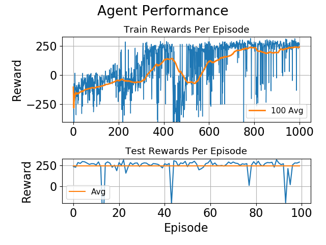

#### Requirements:

gym 
matplotlib 
torch 
torchvision 
Box2D

#### Results:

#### Python Files:

###### ll_pytorch.py

Contains main code to train an agent 
A custom agent can be trained with train_agent 
The default agent used in the paper can be trained with train_default 
If a saved model is found, it can be tested with run_model, with show=True set in order to visualize its performance 
If json files containing data from the training and testing of an agent are present, a plot can be generated with build_plot 

###### experiments.py

Contains code to generate the json files for experiments 1 and 2, as well as the code to generate plots for all the experiments 
Experiments 1 and 2 can be run with run1, run2 
If the json files are present, plots can be generated with plot1, plot7, plot_replay

###### experiment_buffer.py

Contains code specifically for the replay buffer experiments, extracted here as changes to the core logic of handling the replay buffer needed to be made, and wanted to leave the train_agent function unchanged in ll_pytorch.py. 
Can be run to generate replay*.json files, containing the rewards for the experiment that can be plotted in experiments.py

#### Json and Torch Files:
###### mod_1.torch
###### mod_2.torch
###### mod_3.torch
###### v04.json

Result of train_default in ll_pytorch.py, a json file containing the rewards for each episode, and torch models containing the model saved at 1000, 2000, and 3000 timesteps.

###### episode_rewards.json

Result of run_model in ll_pytorch.py, on one of the .torch saved agents

###### exp1.json

Result of run1 in experiments.py, a json file containing the rewards for the various configurations

###### exp7.json
###### exp7_times.json

Result of run2 in experiments.py, json files containing the rewards for the various configurations, and the times taken to run each configuration

###### replay1.json
###### replay2.json
###### replay3.json
###### replay4.json
###### replay5.json
###### replay6.json

Result of experiment_buffer.py, json files containing the rewards for the various configurations

